<div align="center">

# 🎮 AgentForge

### Deep Reinforcement Learning for Autonomous Control

[](https://python.org)
[](https://pytorch.org)
[](https://gymnasium.farama.org)
[](LICENSE)

> *Teaching a neural network to master physical balance through trial, error, and zero labeled data.*


---

</div>

## 📌 Problem Statement

Imagine trying to balance a broomstick on your palm. You'd wobble, overcorrect, drop it — and then try again. Over time, through pure trial and error, you'd get better. **AgentForge works the same way**, except the "palm" is a moving cart, the "broomstick" is a pole, and the "you" is a neural network that has never seen this problem before.

Traditional approaches solve this with hand-written physics equations — formulas that a human engineer explicitly programs. **AgentForge takes a fundamentally different approach:** the AI starts with absolutely zero knowledge and teaches itself to balance the pole purely by trying thousands of times and learning from its own mistakes. This technique is called **Deep Q-Learning (DQN)**.

Under the hood, the agent reads 4 numbers every frame (where the cart is, how fast it's moving, how tilted the pole is, and how fast it's tilting), picks one of two actions (push left or push right), and gradually discovers which sequences of actions keep the pole upright the longest.

**Success Criteria:** The agent must balance the pole for an average of **≥ 195 time steps across 100 consecutive games** — the official OpenAI benchmark for "solved."

---

## 🧠 Architecture

```
                     ┌─────────────────────────────────┐
                     │       ENVIRONMENT (CartPole-v1)  │
                     │   state = [x, ẋ, θ, θ̇]          │
                     └──────────┬──────────────────────┘
                                │ state
                                ▼
┌──────────────────────────────────────────────────────────────┐
│                        DQN AGENT                             │
│                                                              │
│   ┌──────────────┐    ε-greedy     ┌──────────────────────┐  │
│   │ Policy Net   │ ◄──────────────►│  Action Selection    │  │
│   │ (4→128→128→2)│    explore/     │  argmax Q(s,a)       │  │
│   └──────┬───────┘    exploit      └──────────────────────┘  │
│          │                                                   │
│          │ MSE Loss                                          │
│          │                                                   │
│   ┌──────▼───────┐                 ┌──────────────────────┐  │
│   │ Target Net   │ ◄── hard copy ──│  Every 500 steps     │  │
│   │ (frozen)     │    (sync)       │  (target_update_freq) │  │
│   └──────────────┘                 └──────────────────────┘  │
│                                                              │
│   ┌──────────────────────────────────────────────────────┐   │
│   │  Experience Replay Buffer (capacity: 10,000)         │   │
│   │  → stores (s, a, r, s', done) transitions            │   │
│   │  → samples random mini-batches of 64 for training    │   │
│   └──────────────────────────────────────────────────────┘   │
└──────────────────────────────────────────────────────────────┘
                                │ action
                                ▼
                     ┌──────────────────────────────────┐
                     │   reward, next_state, done       │
                     └──────────────────────────────────┘
```

### Key Components

| Component | Implementation | Purpose |
|---|---|---|
| **Q-Network** | 4 → 128 → 128 → 2 (ReLU) | Approximates Q(s,a) for action selection |
| **Target Network** | Frozen copy, synced every 500 steps | Provides stable TD targets during training |
| **Experience Replay** | Circular buffer (10K capacity, batch 64) | Breaks temporal correlation in training data |
| **ε-Greedy Policy** | ε: 1.0 → 0.01 (decay 0.995/episode) | Balances exploration vs. exploitation |
| **Optimizer** | Adam (lr=0.001), MSE loss | Gradient descent with adaptive learning rate |
| **Gradient Clipping** | max_norm=1.0 | Prevents exploding gradients during training |

---

## 📊 Results

### Training Convergence

The DQN agent successfully **solved CartPole-v1** by achieving a rolling average reward of **≥ 195 over 100 episodes**.

<p align="center">
  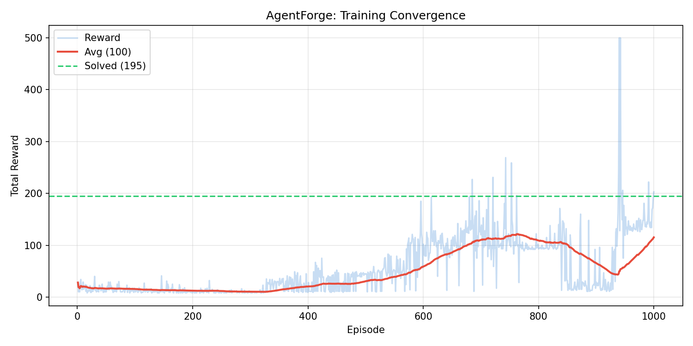
</p>

### Baseline Comparison

The trained DQN agent massively outperforms both baseline strategies:

<p align="center">
  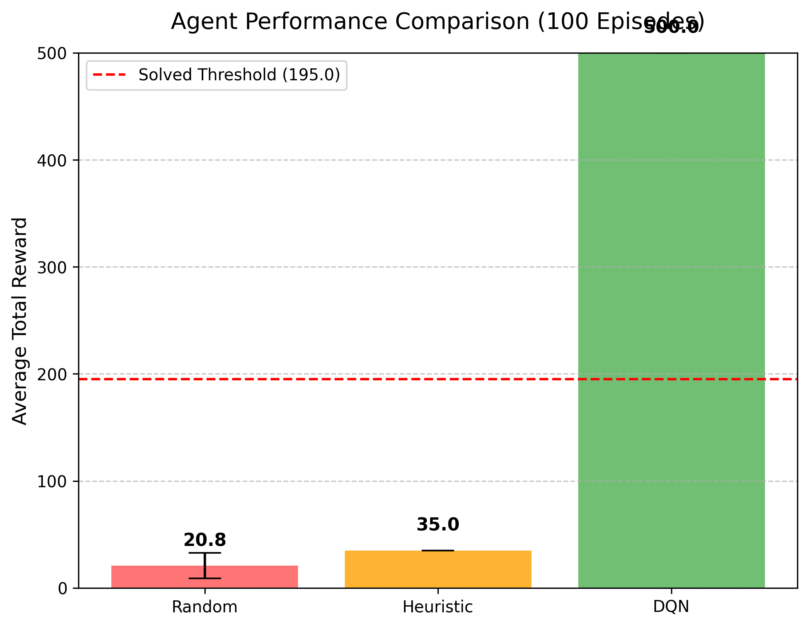
</p>

| Agent | Avg Reward (100 ep) | Strategy |
|---|---|---|
| **Random** | ~20 | Uniform random actions |
| **Heuristic** | ~35 | If angle > 0 → push right, else push left |
| **DQN (Ours)** | **500** ⭐ | Learned optimal policy via Deep Q-Learning |

### Epsilon Decay & Loss Curves

<p align="center">
  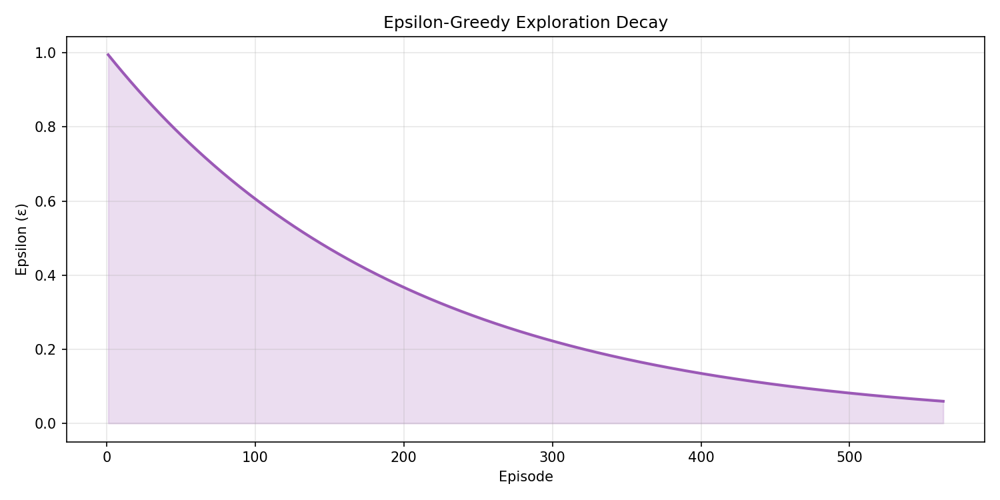
  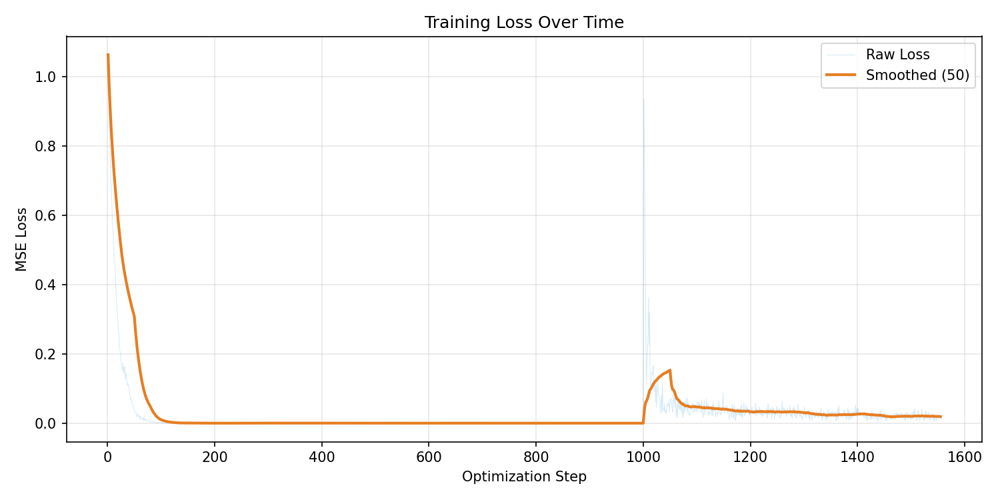
</p>

---

## 🔬 Ablation Studies

We conducted **4 systematic ablation studies** to understand how each hyperparameter affects convergence behavior. In each study, one parameter is varied while all others are held fixed at their tuned defaults.

### Ablation 1 — Replay Buffer Size

> *How much past experience does the agent need to learn effectively?*

<p align="center">
  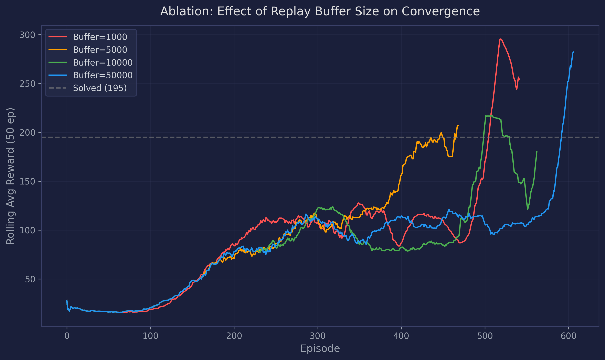
  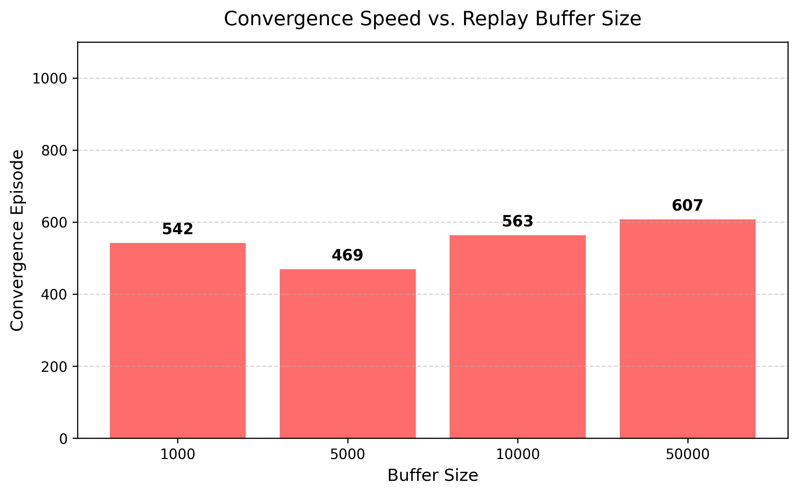
</p>

**Tested:** 1K · 5K · 10K · 50K transitions

---

### Ablation 2 — Epsilon Decay Rate

> *How fast should the agent transition from exploration to exploitation?*

<p align="center">
  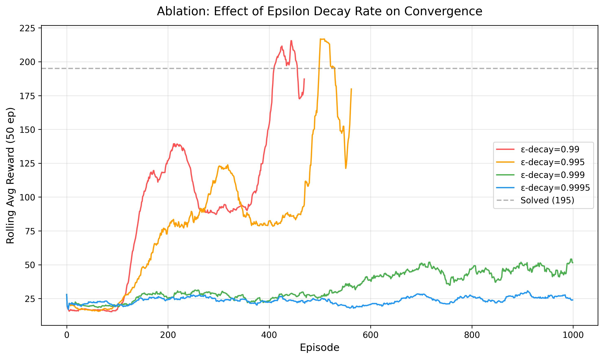
  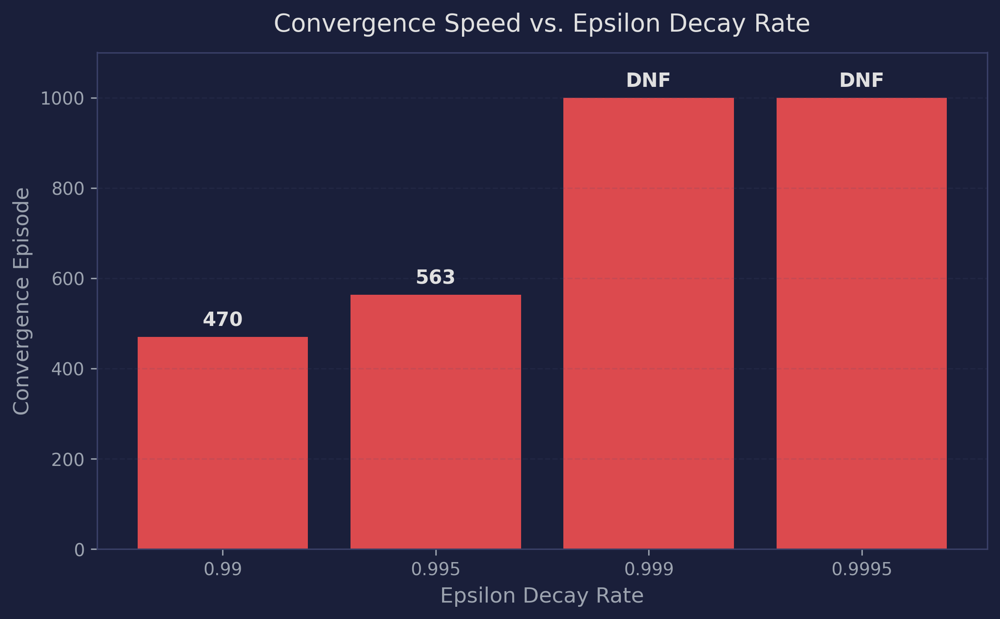
</p>

**Tested:** 0.990 · 0.995 · 0.999 · 0.9995

---

### Ablation 3 — Network Depth

> *Does a deeper Q-network learn a better policy?*

<p align="center">
  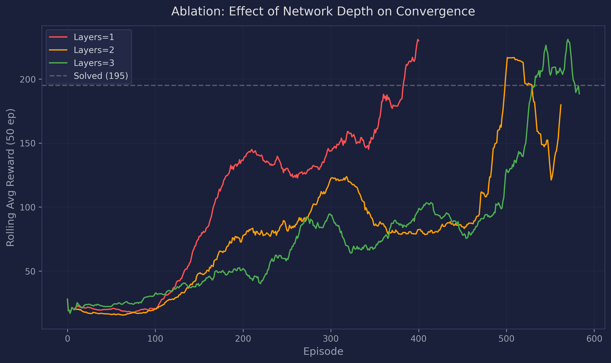
  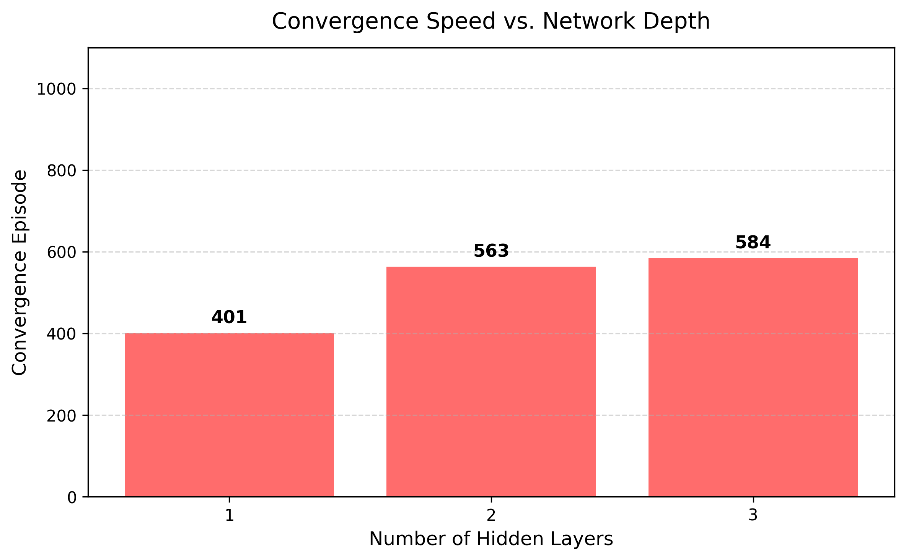
</p>

**Tested:** 1 · 2 · 3 hidden layers (128 neurons each)

---

### Ablation 4 — Target Network Update Frequency

> *How often should the target network synchronize with the policy network?*

<p align="center">
  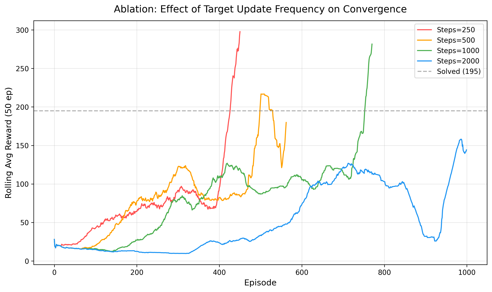
  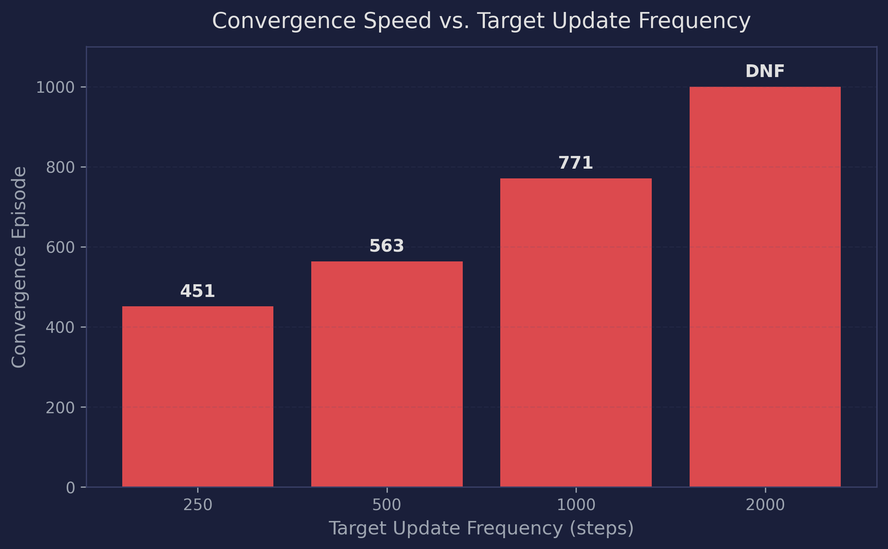
</p>

**Tested:** 250 · 500 · 1,000 · 2,000 steps

---

## 🎯 Double DQN Extension

Standard DQN uses the **same network** to both select and evaluate the best next action, which causes systematic **overestimation of Q-values**. Double DQN fixes this with a simple but powerful change — decouple selection from evaluation:

| | Action Selection | Action Evaluation |
|---|---|---|
| **DQN** | Target Network | Target Network |
| **Double DQN** | Policy Network | Target Network |

```python
# DQN:        y = r + γ · max_a' Q_target(s', a')
# Double DQN: y = r + γ · Q_target(s', argmax_a' Q_policy(s', a'))
```

### Head-to-Head Results

<p align="center">
  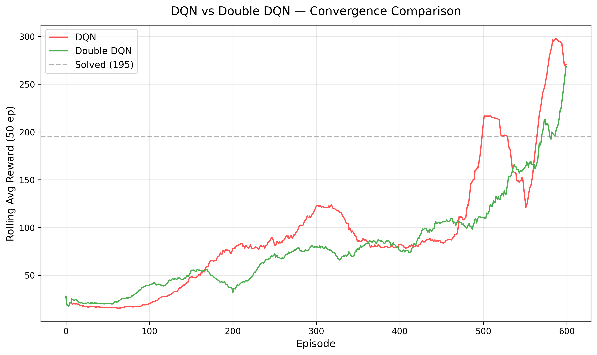
  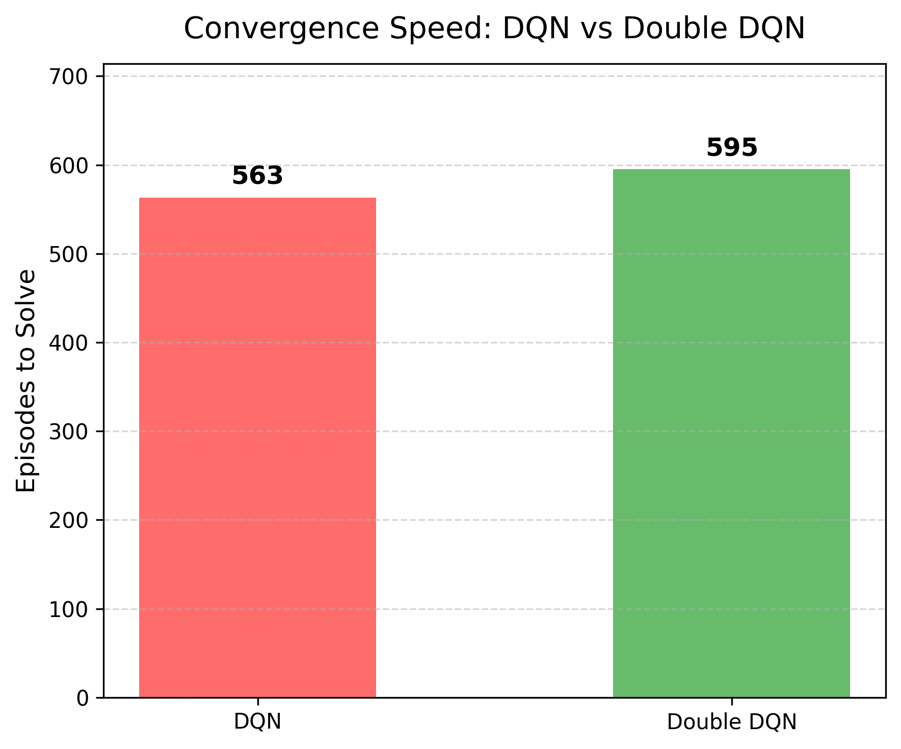
</p>

| Agent | Convergence Episode |
|---|---|
| **Standard DQN** | ~563 |
| **Double DQN** | ~595 |

Both agents solve the environment. On CartPole-v1 the difference is marginal since Q-value overestimation is less harmful in simple environments — but Double DQN becomes critical in complex environments with large action spaces.

> *Reference: van Hasselt et al., "Deep Reinforcement Learning with Double Q-learning", AAAI 2016.*

---

## 🎬 Learning Progression

Three gameplay videos demonstrate the agent's learning journey from random flailing to perfect control:

| Stage | Video | Steps Survived | Description |
|---|---|---|---|
| 🔴 Untrained | `01_untrained.mp4` | ~11 | Random actions, pole falls immediately |
| 🟡 Mid-Training | `02_mid_training.mp4` | ~500 | Loaded from episode 500 checkpoint |
| 🟢 Fully Trained | `03_fully_trained.mp4` | **500** (max) | Perfect balance for the entire episode |

Videos are saved in `results/videos/` and can be regenerated with `PYTHONPATH=. python src/record.py`.

---

## 🚀 Quick Start

```bash
# Clone
git clone https://github.com/Abhics8/AgentForge.git
cd AgentForge

# Install dependencies
pip install -r requirements.txt

# Train the DQN agent (1000 episodes)
PYTHONPATH=. python src/train.py

# Evaluate against baselines
PYTHONPATH=. python src/evaluate.py

# Run all 4 ablation studies
PYTHONPATH=. python src/ablation.py

# DQN vs Double DQN comparison
PYTHONPATH=. python src/compare_dqn.py

# Record gameplay videos
PYTHONPATH=. python src/record.py

# Run hyperparameter tuning
PYTHONPATH=. python src/tune.py
```

---

## 📁 Project Structure

```
AgentForge/
├── configs/
│   └── default.yaml              # All hyperparameters (single source of truth)
├── src/
│   ├── model.py                  # DQN architecture (configurable depth)
│   ├── replay_buffer.py          # Experience replay (10K circular buffer)
│   ├── agent.py                  # DQN agent (ε-greedy, target net, optimize)
│   ├── double_dqn_agent.py       # Double DQN agent (decoupled evaluation)
│   ├── environment.py            # Gymnasium CartPole-v1 wrapper
│   ├── train.py                  # Training loop with convergence detection
│   ├── evaluate.py               # Baseline comparison evaluation
│   ├── compare_dqn.py            # DQN vs Double DQN head-to-head
│   ├── ablation.py               # 4 ablation studies framework
│   ├── record.py                 # Gameplay video recording
│   ├── tune.py                   # Hyperparameter tuning script
│   └── utils.py                  # Plotting, config loading
├── baselines/
│   ├── random_agent.py           # Uniform random baseline (~20 reward)
│   └── heuristic_agent.py        # Rule-based baseline (~35 reward)
├── results/
│   ├── plots/                    # All generated visualizations
│   ├── checkpoints/              # Saved model weights (.pt)
│   ├── logs/                     # Training CSV logs
│   └── videos/                   # Agent gameplay recordings
├── tests/
│   └── test_components.py        # Unit tests
└── requirements.txt
```

---

## ⚙️ Hyperparameters

```yaml
# configs/default.yaml
environment:
  name: CartPole-v1
  solved_reward: 195.0          # OpenAI benchmark threshold
  solved_window: 100            # Rolling window for convergence check

training:
  episodes: 1000
  seed: 42

network:
  hidden_size: 128              # Neurons per hidden layer
  num_hidden_layers: 2          # Network depth

agent:
  replay_buffer_size: 10000     # Experience replay capacity
  batch_size: 64                # Mini-batch size for SGD
  gamma: 0.99                   # Discount factor
  epsilon_start: 1.0            # Initial exploration rate
  epsilon_end: 0.01             # Minimum exploration rate
  epsilon_decay: 0.995          # Multiplicative decay per episode
  learning_rate: 0.001          # Adam optimizer LR
  target_update_freq: 500       # Steps between target net syncs
```

---

## 🛠️ Tech Stack

<p align="center">
  
  
  
  
  
</p>

---

## 📚 References

- Mnih et al., [*Playing Atari with Deep Reinforcement Learning*](https://arxiv.org/abs/1312.5602), DeepMind, 2013
- Mnih et al., [*Human-level control through deep reinforcement learning*](https://www.nature.com/articles/nature14236), Nature, 2015
- Sutton & Barto, [*Reinforcement Learning: An Introduction*](http://incompleteideas.net/book/the-book.html), 2nd ed.

---

<div align="center">

**Built by [Abhi Bhardwaj](https://github.com/Abhics8)**

</div>
